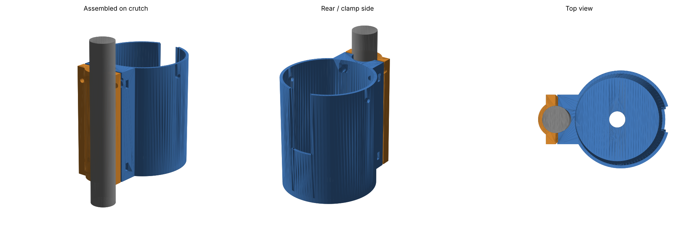

# Crutch Water Bottle Holder

A 3D-printable bottle cup that bolts onto a crutch tube.



## Parts

| File | What it is | Print orientation |
|---|---|---|
| `holder.stl` | Bottle cup + rear clamp half (captive nut slots) | Upright, cup floor on the bed |
| `clamp_cap.stl` | Front clamp half | Flat on its split face (already oriented) |
| `crutch_bottle_holder.scad` | Parametric OpenSCAD source | — |
| `build.py` | Re-exports the STLs and `preview.png` without OpenSCAD | — |

No supports needed. PETG or ASA recommended (PLA softens in a hot car), 4 perimeters, 25–30 % infill.

## Hardware

- 4 × M4 × 20 mm socket-head bolts
- 4 × M4 hex nuts (slide into the side slots on the holder)
- Optional: thin rubber strip / inner-tube scrap around the crutch for grip and to protect the finish
- Optional: ~30 cm of 3 mm elastic cord through the two holes near the rim to stop the bottle bouncing out

## Default dimensions

| Parameter | Default | Notes |
|---|---|---|
| `tube_d` | 22.2 mm | 7/8" — common on forearm crutches. **Measure yours.** |
| `bottle_d` | 75 mm | Fits most 500–750 ml bottles; +2 mm clearance |
| `cup_h` | 100 mm | Cup and clamp height |
| `slot_w` | 22 mm | Front slot to see the water level and give the cup some flex (0 = none) |

Overall size: ~94 × 82 × 100 mm.

## Customising

Open `crutch_bottle_holder.scad` in OpenSCAD, change the parameters (Customizer panel works), set `part` to `holder` or `clamp_cap`, and export STL.

Or edit the matching values at the top of `build.py` and run:

```sh
pip install manifold3d trimesh matplotlib
python build.py
```

The script checks that both parts are watertight, don't overlap each other, and clear the crutch tube.

## Mounting

1. Push the 4 nuts into the side slots of the holder.
2. Place the holder and cap around the crutch below the hand grip (on underarm crutches, the upright below the grip; on forearm crutches, the shaft below the handle).
3. Bolt through the cap ears, tighten evenly until the clamp grips — the 1.5 mm gap between the halves is the clamping travel.
4. Rotate the cup to the outside of the crutch so it doesn't hit your leg.
